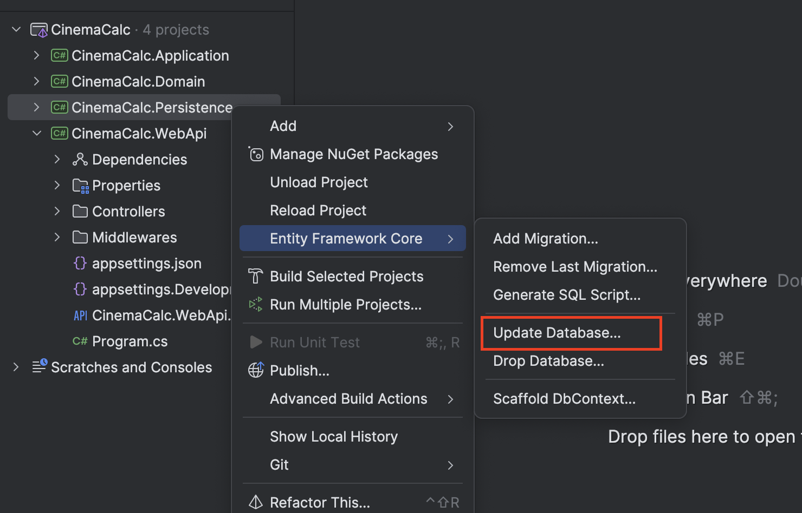
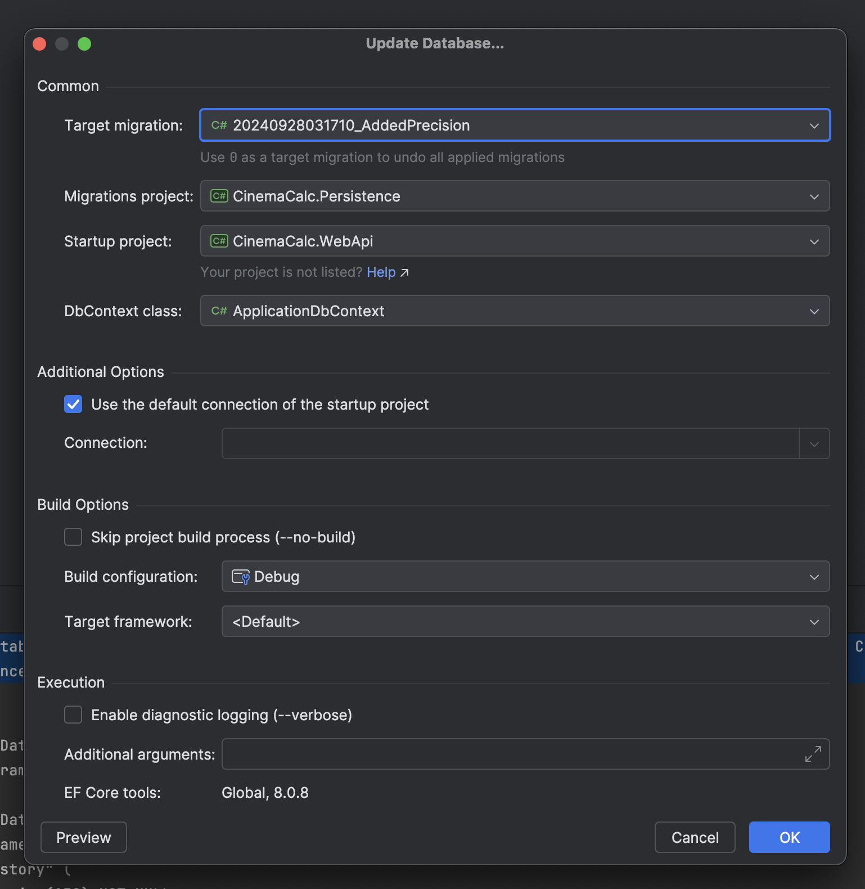
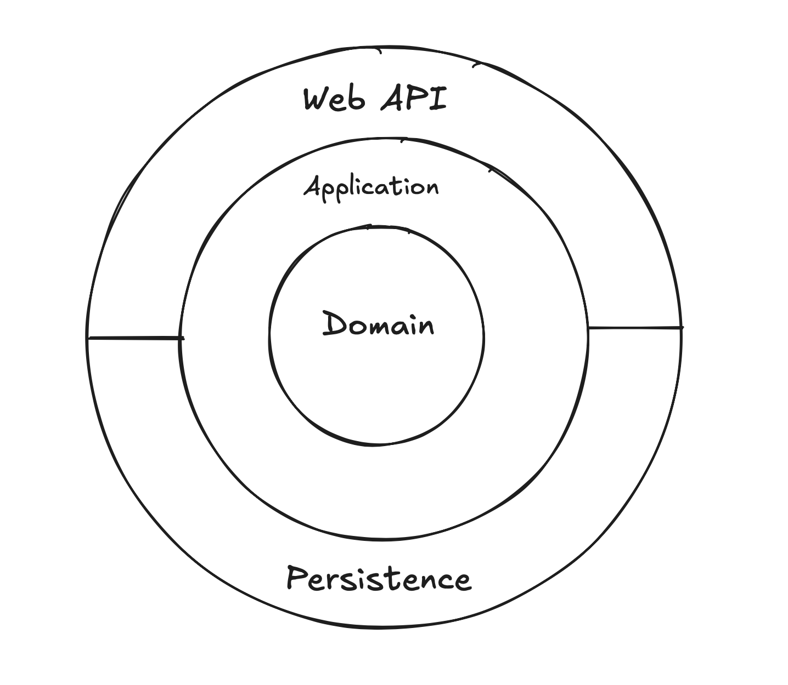

# CinemaCalc

Coding Assignment for "Working Student Full Stack Developer" position at [Those Youngbloods GmbH](https://thoseyoungbloods.com). This project is build with **.NET**, **React with TypeScript** and **PostgreSQL**.


## 01. How to run the project locally?

To run this project locally, kindly follow the steps for each project.

### Back-End

The back-end is build with .NET version `8.0.401`. Make sure your .NET version is compatible with it.

Edit the database connection string and point it to the right **Postgres** server with credentials. You can find the `DefaultConnection` under `ConnectionStrings` in `CinemaCalc.WebApi/appsettings.json`.

Once the connection string is pointing to the right database server, go to the root of the project and run the following command to apply migrations.

```bash
dotnet ef database update --project CinemaCalc.Persistence/CinemaCalc.Persistence.csproj --startup-project CinemaCalc.WebApi/CinemaCalc.WebApi.csproj --context CinemaCalc.Persistence.Data.ApplicationDbContext --configuration Debug 20240928031710_AddedPrecision
```

---
**NOTE: If the above commands fails, you can use the JetBrain's Rider UI to run the migrations.**

Right click on the `CinemaCalc.Persistence` project and go through the following steps.





And then hit `OK`.

---

After that, go the `CinemaCalc.WebApi` project and run the following command to start the server.

```bash
dotnet run
```

### Front-End

The front-end is build with Node `v20.13.1` and React with TypeScript. It lives under the `ClientApp/CinemaCalc` folder.

Create an `.env` file at the root of the front-end project (`ClientApp/CinemaCalc`) with having `VITE_API_URL` as key and back-end API server URL as value. (see `.env.example` at `ClientApp/CinemaCalc/.env.example`)

Run the following command to install all the required packages.

```bash
npm i
```

After that, run the following command to run the application.

```bash
npm run dev
```

## 02. What is the overall structure of your code?

The backend is specifically structured using clean code architecture. I tried to create the same for the front-end but couldn't due to lack of time.



On backend, all the operations are divided into commands and queries and are called through MediatR. This ensures that the application isn't coupled to the presentation layer.

In future if we want to add another presentation layer, say desktop UI with C#, we can easily add that to our solution since the application layer and the core of application is independent of any presentation layer. It can easily be consumed on the desktop application without re-inventing the wheel.

## 03. How do you manage state in your application? Why did you choose this solution?

For managing state on the front-end, I chose [React Query](https://tanstack.com/query/latest/docs/framework/react/overview) for its nice and easy to use interface querying and mutation data. Using this library, I was able to easily achieve optimistic updates while the data was saved and verified on the backend.

In case of any error on the backend, it will quickly revert to its previous state, making sure the client is in sync with the backend server.

If I would have used any other state management solutions, I would have to manually set this up. This would have taken more time and could've introduced bugs in my software.

## 04. How does your approach for precise number calculations work?

For precise number calculations on the backend, I used `decimal` on the C# layer and `numeric(18,2)` on the database layer. The `decimal` type is ideal for financial calculations as it represent number as it is. while the `numeric(18,2)` really locks it down to two decimal places.

Since TypeScript doesn't support decimal natively, I have to reach out for a library called "[decimal.js](https://github.com/MikeMcl/decimal.js)" to perform precise number calculations.

## 05. What "tasks" did you have on your mind? How did you break down the different deliverables?

When I read the project description, I started thinking about how I want to approach this project.

My focus was on creating a beautiful and usable interface while following the principles of clean architecture (at least on the backend).

I divided my tasks into some structure like this;

- Create a clean architecture proof of concept on the backend.
- Create a proof of concept front-end and connect the front-end with the backend.
- Implement all the CRUD functionality on the back-end.
- Implement all the CRUD functionality on the front-end and connect it to the backend.
- Add precise calculations to the backend, and the later on to the front-end.
- Style front-end and make it easy on eye.
- Clean up the code and remove any duplication.
- Write documentation on how to use this project.

## 06. Use the readme as a notepad to make us understand your thinking

I started with a basic understanding of the what the project was about. For that, I created an account on the CinemaCalc application and see what I will be working on.

Then I first started with creating the basic architecture on the backend. Add functionality to it and ran a proof of concept. Once it was working, I moved to the front-end. Since I already had a rough sketch of what I was building, I created a proof of concept on the front-end. Setup the HTTP Client and made calls to the backend server to make sure everything works fine.

Once it was working, I added optimistic updates and polished the UI and added precise calculations to the front-end.

Once all the tasks were completed, I cleaned up the code and made sure it follows all the common coding conventions.

I used my notebook to keep track of what I want to implement on top of the basic functionality. Here are a couple of pictures of my notes.


---

Made with ❤️ by [Syed Muhammad Sawaid](https://syedmsawaid.com) for Those Youngbloods.
